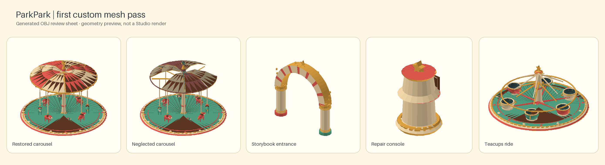

# ParkPark 놀이공원 모델 소스

이 폴더의 OBJ는 입구와 놀이기구를 위한 **직접 제작한 저폴리 메시 원본**입니다. 기본 Part graybox를 최종 모델로 바꿔치기한 것이 아니라, 별도의 메시 지오메트리를 생성합니다.



## 모델 목록

| 파일 | 용도 |
| --- | --- |
| `ParkParkCarouselPlatform.obj` | 고정 원형 플랫폼과 계단 |
| `ParkParkCarouselRotor.obj` | 중앙축, 방사형 지지대, 목마 8개 |
| `ParkParkCanopyRestored.obj` | 코랄·크림 차양, 금빛 장식, 피니얼 |
| `ParkParkCanopyNeglected.obj` | 바랜 차양과 빠진 패널이 있는 폐허 상태 |
| `ParkParkTeacupsPlatform.obj` | 찻잔 라이드의 고정 원형 플랫폼 |
| `ParkParkTeacupsRotor.obj` | 중앙 장식, 회전 지지대, 손잡이 달린 찻잔 6개 |
| `ParkParkStorybookEntrance.obj` | 둥근 아치와 장식 띠 |
| `ParkParkEntranceSign.obj` | SurfaceGui 글자를 얹을 별도 간판 메시 |
| `ParkParkRepairConsole.obj` | 수리 상호작용을 위한 작은 장식 콘솔 |
| `ParkParkEntranceDebris.obj` | 치울 잔해 더미: 부서진 판자, 쪼개진 상자, 쓰러진 표지판, 덤불 |
| `ParkParkBumperPlatform.obj` | 범퍼카 링크: 테두리 바닥, 패드 레일, 바닥 무늬, 가로등 4개 |
| `ParkParkBumperCar.obj` | 범퍼카 1대(정면 -Z): 범퍼 링, 보닛, 좌석, 스파크 폴. 템플릿에서 4대로 복제 |
| `ParkParkTeacupsHub.obj` | 찻잔 회전판: 데크, 받침 6개, 중앙 기둥, 작은 지붕(컵 없음) |
| `ParkParkTeacup.obj` | 찻잔 1개(바닥 y=0, 넓고 얕은 컵). 템플릿에서 6개로 복제되어 각자 회전 |
| `ParkParkLitter.obj` | 바닥에 생기는 쓰레기 한 무더기(컵, 포장지, 팝콘 통, 사과 속) |
| `ParkParkFairground.mtl` | 공통 재질 팔레트 |

## 생성·가져오기

저장소 루트에서 Python 표준 라이브러리만으로 다시 생성할 수 있습니다.

```powershell
python tools/generate_parkpark_meshes.py
```

미리보기 시트는 Pillow가 설치된 환경에서 다시 만들 수 있습니다.

```powershell
python tools/render_parkpark_mesh_preview.py
```

Studio의 OBJ 가져오기는 MTL의 `Kd` 색을 적용하지 않습니다(2026-09-29 확인: 파일마다 회색 MeshPart 하나). 그래서 생성기는 10색 `ParkParkPalette.png`(칸 하나에 32px)를 함께 만들고, 모든 면의 UV를 해당 재질 칸의 중앙으로 지정합니다. MTL에는 `map_Kd`로 팔레트를 연결해 둡니다. 가져온 MeshPart의 `TextureID`에는 업로드한 팔레트 `rbxassetid://101072742922175`를 지정합니다.

현재 사용하는 메시 자산 ID는 `MeshAssets.json`에 기록합니다. 두 번째 가져오기(팔레트 UV 포함)부터는 Importer가 `map_Kd`를 읽어 모델마다 텍스처도 함께 올렸습니다. 템플릿은 그 텍스처 대신 공용 팔레트 하나를 씁니다. 첫 가져오기(UV 없음)의 메시는 더 이상 사용하지 않습니다.

메시를 다시 가져오면 `MeshAssets.json`의 ID를 바꾸고, 저장소 루트에서 템플릿을 다시 만듭니다.

```powershell
python tools/build_parkpark_templates.py
```

템플릿 규칙: 장식 메시는 PhysicsData 없이 `CollisionFidelity=Box`, `CanCollide=false`입니다. 대신 보이지 않는 원기둥 충돌체(`LeftPillarCollider`, `RightPillarCollider`, 놀이기구별 `PlatformCollider`)를 둡니다. `RepairConsole`과 `TeacupsConsole`만 Box 충돌을 사용합니다.

생성기는 저장 전에 연결된 부품마다 면 방향을 바깥쪽 반시계 방향으로 맞춥니다. Roblox는 반시계 방향 면만 앞면으로 그리므로, 이전 OBJ처럼 방향이 섞이면 Studio에서 일부 부품이 속이 빈 것처럼 보입니다.

미리보기는 형상 배치를 빠르게 살펴보는 용도이며 Roblox Studio의 재질·조명 결과를 대신하지 않습니다.

Roblox Studio의 [3D Importer](https://create.roblox.com/docs/studio/importer)에서 OBJ를 가져올 때 `ParkParkFairground.mtl`을 같은 폴더에 두세요. 차양 두 버전은 같은 원점·크기를 사용하며, broken/restored 중 한쪽만 표시하도록 구성합니다. 회전목마 rotor의 원점은 바닥 중앙 회전축에 맞췄습니다.

가져온 뒤 asset model을 다음 규약으로 묶어 `assets/models/roblox/`에 저장합니다. Rojo가 이 폴더를 `ReplicatedStorage/ParkParkAssets`로 동기화하며, `AssetManifest.luau`의 이름을 그대로 사용합니다.

- `RuinedEntrance` Model: 아치 메시와 `SignPanel` MeshPart를 포함하고, floor-center pivot을 사용합니다. `SignPanel`은 root 기준 `[0, 14.2, -1.35]`에 둡니다.
- `BrokenCarousel` Model: 고정 `RidePlatform` MeshPart, 고정 `RepairConsole` MeshPart, `CarouselRotor` Model을 포함합니다. Platform은 root 원점에, 콘솔은 root 기준 `[13, 0, 0]`에 둡니다.
- `TeacupsRide` Model: 고정 `RidePlatform` MeshPart와 `PlatformCollider`, `TeacupsRotor` Model 안의 회전 메시 `RotorCore`, 그리고 고정 `TeacupsConsole` MeshPart를 포함합니다. 모델 pivot은 플랫폼 중심 바닥에 둡니다. Console은 root 기준 `[0, 0, 10.5]`에 놓고 버튼 패널이 입구 쪽을 향하게 합니다.
- `EntranceDebris` Model: 잔해 메시 하나를 `CleanupTarget` MeshPart로 둡니다(root 원점, OBJ 좌표 유지). `ParkBuilder`가 `(-12, 0, 8)`에 배치해 입구 모델 안에 넣고 정리 prompt를 붙입니다. 템플릿이 없으면 graybox 잔해를 씁니다.
- `CarouselRotor` 안에는 회전축 메시 `CenterPost`와 `CanopyNeglected`/`CanopyRestored` canopy variant를 둡니다. `CenterPost` pivot은 회전목마 바닥 중심에 맞춥니다. 콘솔은 rotor 밖에 둡니다.

OBJ 이름과 모델 안 이름은 다음처럼 대응합니다. 아래 방향 규약의 `RepairConsole`을 제외한 MeshPart는 OBJ 좌표 방향을 그대로 유지하고, 모두 `Anchored`로 저장합니다. rotor 쪽 파트는 게임 코드가 `CenterPost`에 weld한 뒤 unanchor합니다.

| OBJ | Studio 이름 | 부모 |
| --- | --- | --- |
| `ParkParkStorybookEntrance.obj` | `EntranceArch` | `RuinedEntrance` |
| `ParkParkEntranceSign.obj` | `SignPanel` | `RuinedEntrance` |
| `ParkParkCarouselPlatform.obj` | `RidePlatform` | `BrokenCarousel` |
| `ParkParkRepairConsole.obj` | `RepairConsole` | `BrokenCarousel` |
| `ParkParkCarouselRotor.obj` | `CenterPost` (중앙축·지지대·목마 전체) | `BrokenCarousel/CarouselRotor` |
| `ParkParkCanopyNeglected.obj` | `CanopyNeglected` | `BrokenCarousel/CarouselRotor` |
| `ParkParkCanopyRestored.obj` | `CanopyRestored` | `BrokenCarousel/CarouselRotor` |
| `ParkParkTeacupsPlatform.obj` | `RidePlatform` | `TeacupsRide` |
| `ParkParkTeacupsRotor.obj` | `RotorCore` (중앙 장식·지지대·찻잔 전체) | `TeacupsRide/TeacupsRotor` |

방향 규약: 메시의 정면(간판 코랄 면, 콘솔 버튼 패널)은 Roblox Part와 같이 local `-Z`입니다. 게임에서 방문자는 `+Z` 쪽 스폰에서 `-Z` 방향의 회전목마로 걸어가므로, `ParkBuilder`는 입구 모델을 Y축 180° 돌려 배치해 아치 정면과 간판이 방문자를 향하게 합니다. 회전목마 모델은 회전하지 않으므로, `RepairConsole`만 모델 안에서 Y축 180° 돌려 버튼 패널이 root `+Z`(입구 쪽)를 보게 합니다. rotor·canopy·platform은 XZ 경계 상자 중심이 원점이라 Importer가 파트 중심을 경계 상자 중심으로 잡아도 회전축이 어긋나지 않습니다.

찻잔 구조물은 OBJ 파일 두 개를 각각 가져옵니다. 두 메시의 XZ 중심은 원점이며, rotor 메시의 바닥 높이와 OBJ 경계 상자 중심은 게임 설정의 좌석 정렬 상수와 템플릿에서 함께 사용합니다. `TeacupsConsole` 프롬프트와 해금/수리 로직은 서버 코드가 만듭니다.

모델에 스크립트를 넣지 않습니다. 수리 prompt, 잔해 상호작용, 상태 변경은 게임 코드가 관리합니다. 규약을 갖춘 모델이 없으면 `ParkBuilder`가 기존 graybox를 계속 생성합니다.

OBJ는 편집 가능한 **메시 원본**입니다. 입구·회전목마·잔해는 Studio 검수를 거쳐 Rojo 템플릿으로 연결되어 있습니다. 새 찻잔 라이드 메시 두 개는 Studio에서 각각 import한 뒤 실루엣, 재질, 피벗과 모바일 구도를 확인하고, 승인된 결과만 `MeshAssets.json`과 Rojo 템플릿에 연결합니다.

`BumperCarsRide` 템플릿: `RidePlatform`(링크), `PlatformCollider`, `BumperConsole`, 그리고 `BumperCars` Model 안의 `BumperCar1`~`BumperCar8` MeshPart(전부 Anchored, 링 위 반지름 5.5 유닛에 접선 방향으로 배치)를 둡니다. 차는 서버(`BumperCarService`)가 매 프레임 CFrame으로 움직이고, 손님은 차에 용접됩니다. 링크와 차 배율은 `GameConfig.BumperScale`/`BumperCarScale`에서 읽습니다.

템플릿에서 메시를 확대할 때 `Size`만 키우고 `InitialSize`는 OBJ의 원래 크기로 둡니다. Roblox는 `Size / InitialSize`로 메시를 확대하므로, 둘을 같은 값으로 저장하면 확대되지 않은 채 충돌 상자만 커집니다.

`TeacupsRide` 새 구조: `TeacupsRotor/RotorCore`(허브 메시)와 `TeacupCups/TeacupCup1~6`(컵 메시, Anchored)를 둡니다. 컵은 링 반지름 6 유닛, 받침 높이 1.42 유닛 위에 놓이며 `TeacupService`가 매 프레임 허브와 함께 돌리고 각자 회전시킵니다. `Litter` 템플릿은 `LitterPiece` MeshPart 하나를 가진 Model입니다. 모든 배율은 `GameConfig.luau`에서 읽습니다.
